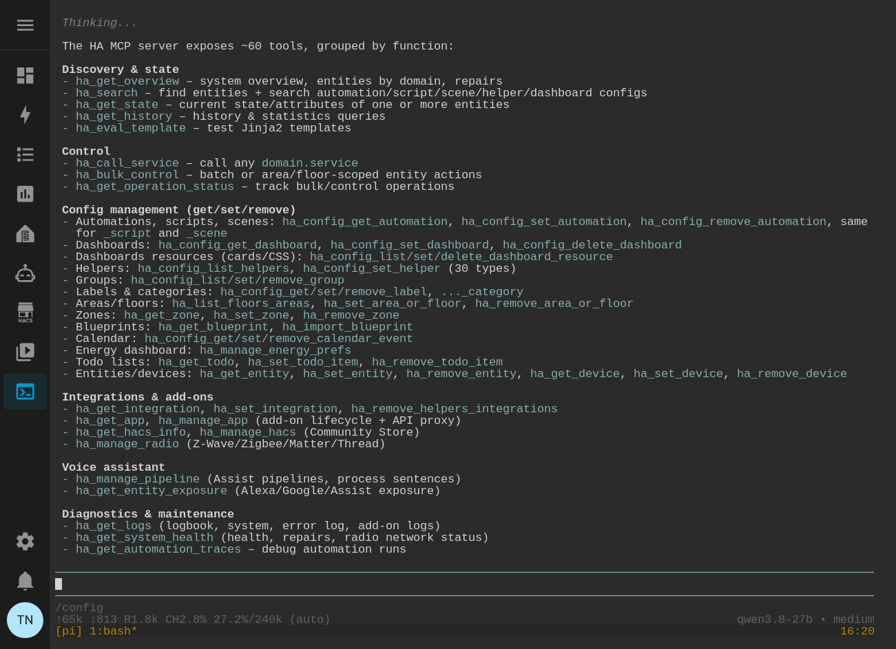

# Pi Agent Terminal for Home Assistant

A Home Assistant add-on that runs the [pi coding agent](https://pi.dev/) in a browser-based terminal, right inside your dashboard. It ships the `ha` CLI for managing Home Assistant, git, and ripgrep — keeps your session alive across restarts with tmux, and opens in your `/config` directory. On every start it syncs the [home-assistant-best-practices agent skill](#home-assistant-best-practices-skill), and can optionally drive Home Assistant through an [MCP server](#home-assistant-control-ha-mcp--optional).

Inspired by [esjavadex/claude-code-ha](https://github.com/esjavadex/claude-code-ha) (MIT).



## Install

**From within Home Assistant**, use this button to open the add-repository screen with this repo pre-filled:

[](https://my.home-assistant.io/redirect/supervisor_add_addon_repository/?repository_url=https%3A%2F%2Fgithub.com%2Fdatapush3r%2Fpi-agent-ha)

Or add it manually:

1. **Settings → Add-ons → Add-on Store**
2. Top-right menu (⋮) → **Repositories**
3. Add `https://github.com/datapush3r/pi-agent-ha` and click **Add**
4. Install **Pi Agent Terminal**, start it, and open the panel from the sidebar

The container image is pre-built for each supported architecture and hosted on GitHub Container Registry — installing and updating pull the image instead of building it on your Home Assistant box.

## Options

| Option | Default | Description |
| --- | --- | --- |
| `auto_launch_pi` | `true` | Launch pi as soon as the terminal opens. Set `false` to get a plain shell and start pi yourself. |
| `tmux_mouse` | `false` | Enable tmux mouse capture. Off by default so browser copy/paste (e.g. pasting `/login` codes) keeps working. |
| `provider` | *(empty)* | pi provider name passed as `--provider` (empty = pi's default). |
| `model` | *(empty)* | pi model pattern or ID passed as `--model`, e.g. `anthropic/claude-sonnet-4-5`. |
| `api_key` | *(empty)* | Provider API key. When set, it is exported as the env var named by `api_key_env`. Leave empty to use interactive `/login` in the terminal. |
| `api_key_env` | `ANTHROPIC_API_KEY` | Env var name used for `api_key` (e.g. `OPENAI_API_KEY` for OpenAI). |
| `local_base_url` | *(empty)* | Base URL of a local OpenAI-compatible LLM server, e.g. `http://192.168.1.10:8080/v1`. When set, `models.json` is generated from the `local_*` options — no file editing needed. |
| `local_model` | *(empty)* | Model id of the local LLM, e.g. `qwen3.8-27b`. Used as `--model` when `model` is empty. |
| `local_provider_name` | `ninfer` | Provider key in the generated `models.json`. Used as `--provider` when `provider` is empty. |
| `local_api` | `openai-completions` | API dialect of the server. |
| `local_api_key` | *(empty)* | API key for the server; a dummy value is used when empty (keyless servers). |
| `local_reasoning` | `true` | Set `false` if the model is not a reasoning model. |
| `local_context_window` | `240000` | Context window of the local model, in tokens. |
| `local_max_tokens` | `8192` | Max output tokens of the local model. |
| `ha_mcp_url` | *(empty)* | MCP server URL pi connects to for Home Assistant control. Set it to the [ha-mcp app's](https://github.com/homeassistant-ai/ha-mcp) MCP URL (from its Logs tab) to enable; empty = no HA tools. |
| `ha_mcp_token` | *(empty)* | Optional Bearer token, only if the MCP endpoint requires one (e.g. HA's built-in `/api/mcp`). The ha-mcp app's secret-URL endpoint does not. |
| `hide_ha_output` | `true` | Hide ha-mcp tool result bodies in the TUI (the call line stays visible). `false` = pi's default rendering with full output inline. |

## Authentication

Two ways, both work:

- **Add-on option:** set `api_key` (and `api_key_env` if your provider isn't Anthropic). The key is exported into the container at startup.
- **Interactive:** leave `api_key` empty and run `/login` inside the pi terminal. Auth state persists in `/data` across restarts.

## Persistence

- pi settings, auth, and session history live in `/data/home/.pi/agent` (survives add-on updates and HA restarts).
- The pi session runs in a **persistent tmux session** — closing the browser tab or restarting Home Assistant does not kill it; reopening reattaches to the same one.

## Local LLMs (Ollama / LM Studio / vLLM / any OpenAI-compatible server)

**Easiest: the add-on options.** Set `local_base_url` and `local_model` — `models.json` is generated for you at startup, no file editing. Adjust `local_reasoning`, `local_context_window`, and `local_max_tokens` to match your model. When `local_base_url` is set, `provider`/`model` fall back to the local LLM (`local_provider_name`/`local_model`) automatically, so a local-only setup needs just those two fields. To launch a cloud model instead, set `provider`/`model` explicitly (or switch anytime with `/model` in the terminal).

Example: local LLM at `192.168.1.10:8080`, model `qwen3.8-27b` (240k context, reasoning):

| Option | Value |
| --- | --- |
| `local_base_url` | `http://192.168.1.10:8080/v1` |
| `local_model` | `qwen3.8-27b` |

Notes:

- **Networking:** the add-on is a container, so `localhost`/`127.0.0.1` points at the add-on itself, not the HA host. Use your LLM server's LAN IP, or a Docker network alias if it runs in Docker on a shared network.
- Reasoning/thinking models (ones returning a `reasoning_content` field) need `local_reasoning: true` so pi parses the thinking tokens instead of waiting for normal content.
- The generated file is rewritten on every add-on start at `/data/home/.pi/agent/models.json` — edit the options, not the file.

### Advanced: hand-written models.json

Prefer full control (multiple models, `compat` flags, custom fields)? Drop a file at **`/config/pi-agent-ha/models.json`** (editable in the HA file editor) and leave `local_base_url` empty — the UI options take precedence when set. The add-on syncs the file into pi's state dir on start (only when it's newer), and pi reloads it every time you open `/model`, so edits apply **without restarting**.

```json
{
  "providers": {
    "ollama": {
      "baseUrl": "http://192.168.1.50:11434/v1",
      "api": "openai-completions",
      "apiKey": "ollama",
      "models": [
        { "id": "qwen2.5-coder:32b" }
      ]
    }
  }
}
```

Then set the add-on option `provider` to the provider key (e.g. `ollama`) and/or pick the model with `/model` in the terminal.

- `apiKey` may be a dummy value for keyless servers (Ollama ignores it) — pi requires *some* value before the model appears in `/model`.
- Some OpenAI-compatible servers need `"compat": { "supportsDeveloperRole": false, "supportsReasoningEffort": false }` at the provider level.

## Home Assistant control (ha-mcp) — optional

pi can read and control Home Assistant through a **Model Context Protocol
(MCP) server**. Set `ha_mcp_url` to an MCP server URL and pi gets two tools:

- `ha_tools` — discover the tools the server exposes (with descriptions and input schemas).
- `ha_call` — call one of those tools by name with JSON arguments.

Leave `ha_mcp_url` empty and the add-on runs exactly the same without HA
control — the extension is a graceful no-op.

**Recommended backend: the
[homeassistant-ai ha-mcp server app](https://github.com/homeassistant-ai/ha-mcp).**
A full-featured HA MCP server — beyond controlling entities it can build and
edit automations, dashboards, and scripts; debug automations from traces;
read history and logs; and manage helpers, areas, zones, labels, HACS,
backups, and the device/entity registry. Quickstart:

1. **Add its repo** (once): Settings → Apps → ⋮ → *Repositories* → add
   `https://github.com/homeassistant-ai/ha-mcp`.
2. **Install and start** the **Home Assistant MCP Server** app, then copy its
   **MCP URL** from the app's **Logs** tab.
3. Paste the URL into this add-on's **`ha_mcp_url`** option and restart pi-agent-ha.

pi then lists the server's tools via `ha_tools` and drives Home Assistant via
`ha_call`. **Alternative backend:** HA's built-in MCP server — set
`ha_mcp_url` to `http://homeassistant:8123/api/mcp` and `ha_mcp_token` to an
HA long-lived access token (simpler, entity-control-focused tool set).

**By default the tool call line is shown** (`HA call → hass_turn_on`) **but the
result output is hidden**, so HA calls stay visible without cluttering the
terminal. Press `ctrl+o` (pi's *expand tool output* keybinding) to show the
full output. Set the `hide_ha_output` option to `false` to restore pi's
default rendering (full output inline). This is display-only — the model
always receives the full result.

**[Full ha-mcp guide →](https://github.com/datapush3r/pi-agent-ha/blob/master/pi-agent-ha/HA-MCP.md)** —
backends in detail, tool reference, behavior notes, options, and
troubleshooting.

## Home Assistant best-practices skill

On every start the add-on syncs the
[`home-assistant-best-practices`](https://github.com/homeassistant-ai/skills)
agent skill from the [homeassistant-ai/skills](https://github.com/homeassistant-ai/skills)
repo (MIT) into pi's global skills directory
(`~/.pi/agent/skills/home-assistant-best-practices`). pi implements the
[Agent Skills standard](https://agentskills.io) natively — no setup, no
options.

**What it is.** A decision workflow and a critical anti-pattern table in
`SKILL.md`, backed by 14 reference docs the agent loads on demand. Core
principle: use native Home Assistant constructs wherever possible — templates
bypass validation and fail silently at runtime. It covers:

- **Authoring** — purpose-specific triggers/conditions over templates (the
  post-2026.7 defaults), helper selection (`min_max`, `threshold`,
  `derivative`, …) and Template Helpers over YAML, correct automation modes
  (`restart` for motion lights, …), `entity_id` over `device_id`,
  button/remote patterns, scenes, and blueprints.
- **Dashboards** — Lovelace layout, views, cards, and card-type lookups.
- **Operations** — safe refactoring (impact analysis before renames),
  YAML-only integration management, and when a backup is actually required.
- **AppDaemon** — when to use it over native HA, and how to structure apps.

**How it works in pi.** Only the skill's short description is always in
pi's context (progressive disclosure). When a task matches — creating or
editing automations, scripts, scenes, dashboards, or blueprints; choosing
helpers or templates; renaming entities; looking up card types or domain
docs; writing AppDaemon apps; or deleting/restoring a backup or upgrading
Core/OS — pi loads the full `SKILL.md` and follows it, pulling in the
relevant reference docs as needed. You can also load it explicitly with
`/skill:home-assistant-best-practices` in the terminal.

**Updates.** The skill is fetched from the upstream `main` branch on each
start, so fixes from upstream flow through without an image rebuild or
version bump. A failed download (e.g. no internet at start) or an upstream
repo layout change keeps the previously synced copy — the skill is only
replaced after the new `SKILL.md` is verified — and pi runs normally
either way. Check the add-on log for the `HA skill: synced …` line.

## Architecture support

`amd64`, `aarch64` (pre-built images on GHCR, `ghcr.io/home-assistant/base` multi-arch base).

## License

AGPL-3.0 (GNU Affero General Public License v3.0). Copyright (C) 2026 datapush3r. See [LICENSE](LICENSE) for full terms.
